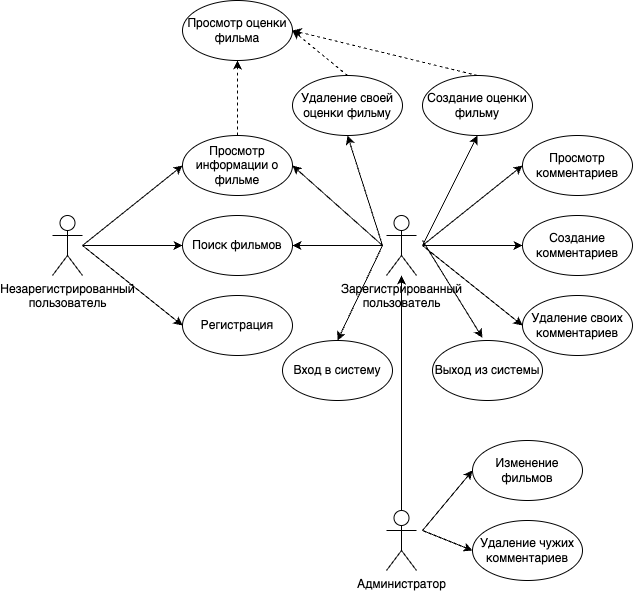
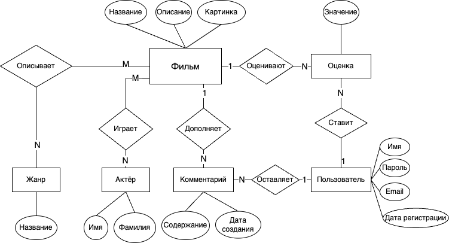

# Каталог фильмов

Проект представляет собой веб-приложение, которое позволяет пользователям
просматривать и искать фильмы по различным критериям, а также оставлять
комментарии и
оценки фильмов. Цель проекта - создать удобный и интуитивно понятный интерфейс
для поиска и просмотра информации о фильмах, а также собрать информацию о
предпочтениях пользователей.

Предметная область приложения с каталогом фильмов относится к области
развлечений и досуга, где пользователи могут просматривать и искать фильмы по
различным критериям, а также оценивать и обсуждать фильмы с другими
пользователями
в комментариях.

### Анализ аналогичных решений

| Критерий              | IMDb                                                                                                   | Кинопоиск                                                                                                                                               |
|-----------------------|--------------------------------------------------------------------------------------------------------|---------------------------------------------------------------------------------------------------------------------------------------------------------|
| Функциональность      | Позволяет просматривать и искать фильмы, оставлять отзывы и оценки, создавать списки избранных фильмов | Позволяет просматривать и искать фильмы, оставлять отзывы и оценки, создавать списки избранных фильмов, а также покупать билеты на фильмы в кинотеатрах |
| Интерфейс             | Интуитивно понятный интерфейс, удобный для просмотра и поиска фильмов                                  | Интуитивно понятный интерфейс, удобный для просмотра и поиска фильмов, а также для покупки билетов                                                      |
| Алгоритм рекомендаций | Использует алгоритм рекомендаций на основе предпочтений пользователей и оценок фильмов                 | Использует алгоритм рекомендаций на основе предпочтений пользователей и оценок фильмов, а также учитывает популярность фильмов в кинотеатрах            |

### Перечень функциональных требований

- Регистрация пользователей
- Авторизация и аутентификация пользователей
- Просмотр и поиск фильмов по названию/описанию/актёрам
- Просмотр комментарием к фильмам
- Оставление комментариев к фильмам
- Удаление комментариев к фильмам (пользователь и администратор)
- Оставление оценок к фильмам
- Изменение фильмов в каталоге (создание/редактирование/удаление) -
  администратор

### Use-Case

### ER - диаграмма

### Сценарии

1. **Поиск нужного фильма**

    - Шаг 1: Регистрация
      Пользователь открывает приложение и вводит свои учетные данные для
      регистрации.

    - Шаг 2: Вход в приложение
      Пользователь открывает приложение и вводит свои учетные данные для входа.

    - Шаг 3: Поиск фильма
      Пользователь вводит название фильма или описание или актёра в строку
      поиска.
      Приложение отображает список фильмов, соответствующих запросу.

    - Шаг 4: Просмотр информации о фильме
      Пользователь выбирает фильм из списка и просматривает информацию о нем,
      включая описание, оценку и комментарии.

2. **Оставление комментария к фильму**

    - Шаг 1: Регистрация
      Пользователь открывает приложение и вводит свои учетные данные для
      регистрации.

    - Шаг 2: Вход в приложение
      Пользователь открывает приложение и вводит свои учетные данные для входа.

    - Шаг 3: Поиск фильма
      Пользователь вводит название фильма или описание или актёра в строку
      поиска.
      Приложение отображает список фильмов, соответствующих запросу.

    - Шаг 4: Выбор фильма из списка
      Пользователь выбирает фильм из списка.

    - Шаг 5: Пользователь нажимает на кнопку "Оставить комментарий", пишет
      комментарий и нажимает кнопку "Опубликовать".

3. **Удаление нецензурного комментария**

    - Шаг 1: Вход в приложение администратора.
      Администратор открывает приложение и вводит свои учетные данные для входа.

    - Шаг 3: Поиск фильма
      Администратор вводит название фильма или описание или актёра в строку
      поиска.
      Приложение отображает список фильмов, соответствующих запросу.

    - Шаг 4: Выбор фильма из списка
      Администратор выбирает фильм из списка.

    - Шаг 5: Администратор удаляет нецензурный комментарий
      Администратор видит нецензурный комментарий и нажимает у него кнопку "
      Удалить".
      Комментарий удалён.

### Экраны

[Figma](https://www.figma.com/design/A2jQGHOg7lxH5ARWVVP7xG/%D0%9A%D0%B0%D1%82%D0%B0%D0%BB%D0%BE%D0%B3-%D1%84%D0%B8%D0%BB%D1%8C%D0%BC%D0%BE%D0%B2?node-id=0-1&node-type=canvas&t=37myWwwNNb62hvUV-0)