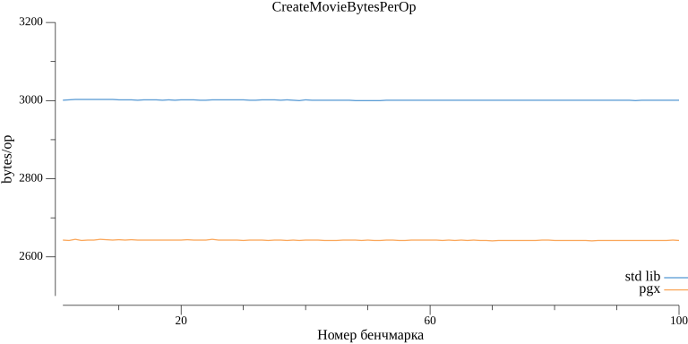
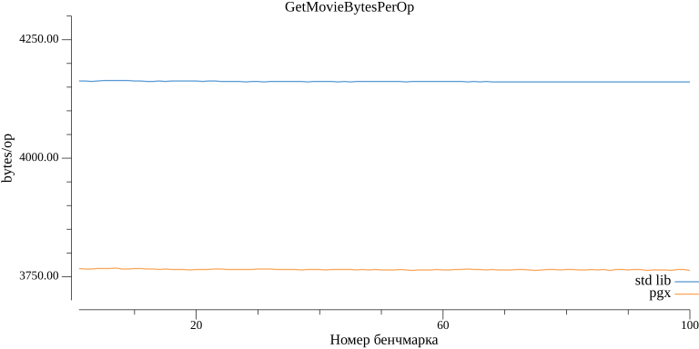
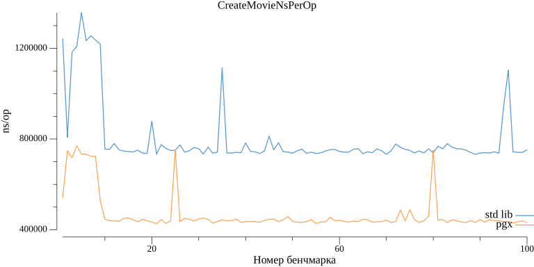
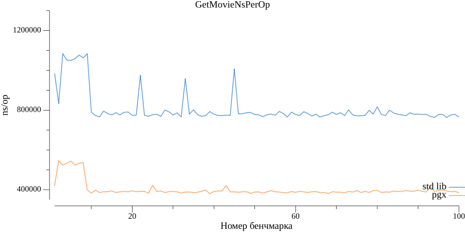
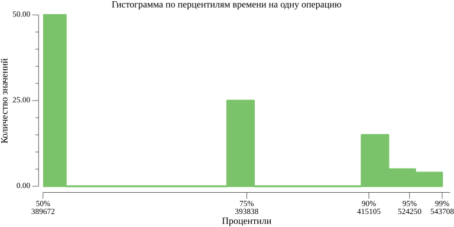
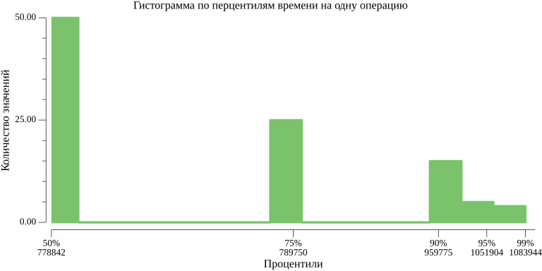

## Benchmark

Сравнивались библиотеки для выполнения SQL запросов: стандартная библиотека Go и 
[PGX](https://pkg.go.dev/github.com/jmoiron/sqlx)

Сравнение происходило на основании двух методов: создание фильма и получение фильма. 
Для обоих методов выполняется запрос к базе данных (Postgres).

На каждый из 100 запусков бенчмарка поднимался контейнер с базой с помощью
[testcontainers](https://golang.testcontainers.org/). Запросы выполнялись 
к базе в этом контейнере.

### Графики с результатами:

1. Количество выделяемой памяти на операцию - метод CreateMovie


2. Количество выделяемой памяти на операцию - метод GetMovie



3. Затраченное время на одну операцию - метод CreateMovie


4. Затраченное время на одну операцию - метод GetMovie



7. Гистограмма с распределением по перцентилям затраченного времени на операцию - метод CreateMovie с PGX

8. Гистограмма с распределением по перцентилям затраченного времени на операцию - метод CreateMovie со стандартной библиотекой

9. Гистограмма с распределением по перцентилям затраченного времени на операцию - метод GetMovie с PGX

10. Гистограмма с распределением по перцентилям затраченного времени на операцию - метод GetMovie со стандартной библиотекой



### Запуск
Для запуска нужно выполнить в корне проекта:
```
make bench
```

После обработки данных появятся два текстовых файла с результатами 
и картинки с графиками по этим результатам